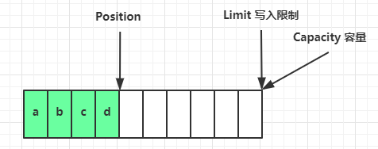
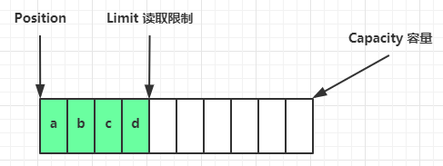
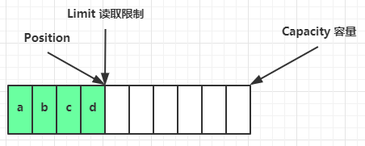
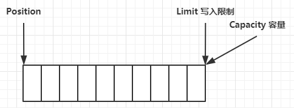
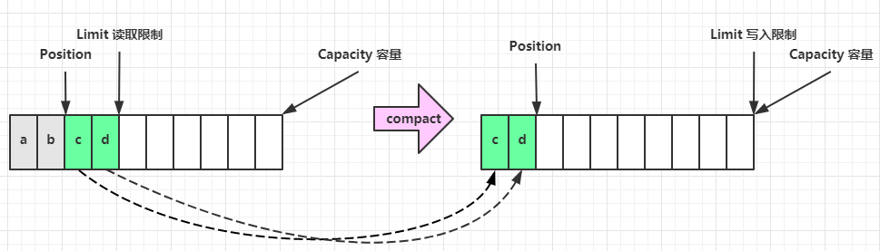
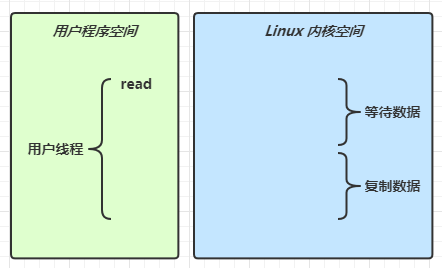
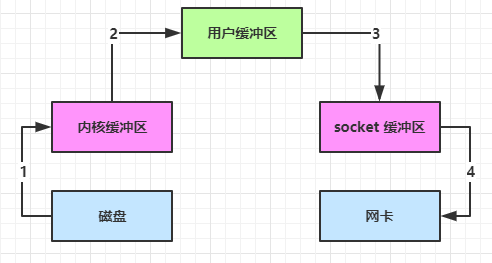
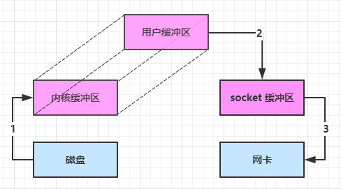
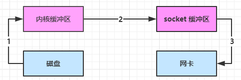
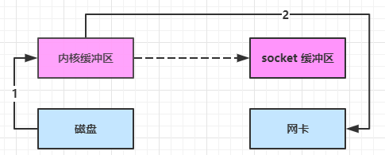

[toc]

# NIO（Non-blocking IO）

## ByteBuffer

> `Buffer`是非线程安全的

相关代码见：<u>cn.thomas.netty.chapter01.Code01_ByteBufferTest</u>

### 常用方法

* **读写功能：<u>Code01_ByteBufferTest#test_byteBufferReadWrite()</u>**

  写入：

  ```java
  // 写入单个字节
  buffer.put((byte) 0x61);
  // 写入字节数组
  buffer.put(new byte[]{0x62, 0x63, 0x64});
  ```

  读出：

  ```java
  // 获取buffer中一个字节
  buffer.get()
  ```

* **模式切换：<u>Code01_ByteBufferTest#test_byteBufferReadWrite()</u>**

  `ByteBuffer`实例化后默认为写模式

  ```java
  // 切换成读模式
  buffer.flip();
  
  // 切换成写模式
  buffer.clear();		// 清空buffer数组，position设置为0
  buffer.compact();	// 保留未读取的字节
  ```

* **内存分配：<u>Code01_ByteBufferTest#test_allocate()</u>**

  可分配堆内存，或分配直接内存

  ```java
  // class java.nio.HeapByteBuffer 堆内存，读写效率较低，受到垃圾回收影响
  ByteBuffer buffer = ByteBuffer.allocate(16);
  // class java.nio.DirectByteBuffer 直接内存，读写效率高（少一次拷贝），分配内存的效率较低，使用不当可能会造成内存泄漏
  ByteBuffer buffer = ByteBuffer.allocateDirect(16);
  ```

* **读功能扩展：<u>Code01_ByteBufferTest#test_byteBufferReadExtend</u>**

  `mark()`&`reset()`

  ```java
  // 标记当前position位置
  buffer.mark();
  // 将position值设置会mark标记位置
  buffer.reset();
  ```

  `get()`&`get(i)`

  ```java
  // 获取position位置的字节，并且position自增
  buffer.get();
  // 获取指定下标索引位置的字节，不改变position位置的值
  buffer.get(i);
  ```

* **与字符串的转换：<u>Code01_ByteBufferTest#test_ByteBufferString()</u>**

  字符串 转化为 `ByteBuffer`：

  ```java
  ByteBuffer buffer = ByteBuffer.allocate(16);
  buffer.put("hello".getBytes());
  ```

  通过`Charset`获取读模式的`ByteBuffer`：

  ```java
  ByteBuffer buffer = StandardCharsets.UTF_8.encode("hello");
  ```

  通过`ByteBuffer.warp()`方法获取读模式的`ByteBuffer`：

  ```java
  ByteBuffer buffer = ByteBuffer.wrap("hello".getBytes());
  ```

  `ByteBuffer`转化为字符串：

  ```java
  StandardCharsets.UTF_8.decode(buffer).toString()
  ```

* **分散读取&集中写入：**

  分散读取：**<u>Code01_ByteBufferTest#test_scatteringRead()</u>**

  ```java
  ByteBuffer buffer1 = ByteBuffer.allocate(3);
  ByteBuffer buffer2 = ByteBuffer.allocate(3);
  ByteBuffer buffer3 = ByteBuffer.allocate(5);
  
  channel.read(new ByteBuffer[]{buffer1, buffer2, buffer3});
  ```

  集中写入：**<u>Code01_ByteBufferTest#test_gatheringWrite()</u>**

  ```java
  ByteBuffer buffer1 = StandardCharsets.UTF_8.encode("hello");
  ByteBuffer buffer2 = StandardCharsets.UTF_8.encode("world");
  ByteBuffer buffer3 = StandardCharsets.UTF_8.encode("你好");
  
  channel.write(new ByteBuffer[]{buffer1, buffer2, buffer3});
  ```

### 结构

`ByteBuffer`有以下三个重要属性：

* capacity：容量
* limit：读写限制
* position：读写指针

1. **初始化后：**

   

2. **写模式下，position 是写入位置，limit 等于容量，下图表示写入了 4 个字节后的状态**

   

3. **flip 动作发生后，position 切换为读取位置，limit 切换为读取限制**

   

4. **读取 4 个字节后，状态**

   

5. **clear 动作发生后，状态**

   

6. **compact 方法，是把未读完的部分向前压缩，然后切换至写模式**

   


## 文件编程

相关代码见：<u>cn.thomas.netty.chapter01.Code02_FileTest</u>

### FileChannel

> `FileChannel`只能在阻塞模式下工作

#### 常用方法

1. **获取：**

   不能直接打开`FileChannel`，必须通过`FileInputStream`、`FileOutputStream`或者`RandomAccessFile`来获取`FileChannel`，它们都提供了`getChannel()`方法

   * 通过`FileInputStream.getChannel()`获取的`channel`只能读
   * 通过`FileOutputStream.getChannel()`获取的`channel`只能写
   * 通过`RandomAccessFile.getChannel()`是否能读写根据构造`RandomAccessFile`是的读写模式决定

2. **读取：**

   会从`channel`读取数据填充`ByteBuffer`，返回值标识督导了多少字节，-1标识到达了文件末尾

   ```java
   int readBytes = channel.read(buffer);
   ```

3. **写入：**

   在`while`循环中调用`channel.write()`是因为`write()`方法并不能保证一次将`buffer`中的内容全部写入到`channel`

   ```java
   while(buffer.hasRemainging()) {
       channel.write(buffer);
   }
   ```

4. **关闭：**

   `channel`必须关闭，不过调用了`FileInputStream`、`FileOutputStream`或者`RandomAccessFile`的`close()`方法会间接调用`channel.close()`方法

5. **位置：**

   获取当前位置

   ```java
   long pos = channel.position();
   ```

   设置当前位置

   ```java
   long newPos = ...;
   channel.position(newPos);
   ```

   设置当前位置时，如果设置为文件的末尾

   * 这时读取会返回 -1 
   * 这时写入，会追加内容，但要注意如果 position 超过了文件末尾，再写入时在新内容和原末尾之间会有空洞（00）

6. **大小：**

   使用`channel.size()`方法获取文件的大小

7. **强制写入：**

   操作系统处于性能的考虑，会将数据缓存，不是立刻写入磁盘。可以调用`channel.force(true)`方法将文件内容和元数据（文件的权限信息等）立刻写入磁盘

8. **transformTo()**&**transformFrom()：<u>FileChannelTest.test_transform()</u>**

   底层使用零拷贝，效率高

   * `transformFrom()`：目标端调用，从源端拉取数据
   * `transformTo()`：源端调用，向目标端传输数据

   ```java
   String from = "src/test/resources/data.txt";
   String to = "src/test/resources/data_transform.txt";
   
   try (FileChannel fromChannel = new FileInputStream(from).getChannel();
        FileChannel toChannel = new FileOutputStream(to).getChannel()) {
       long size = fromChannel.size();
       for (long left = size; left > 0; ) {
           log.debug("position: {}, left: {}", size - left, left);
           // 每次最多只能传输2G内容
           left -= fromChannel.transferTo(size - left, (left), toChannel);
       }
   } catch (IOException e) {
       e.printStackTrace();
   }
   ```

### Path&Paths

> JDK 1.7引入了`Path`和`Paths`类，`Path`用来表示文件路径，`Paths`是工具类，用来获取`Path`实例

<u>**cn.thomas.netty.chapter01.Code02_FileTest#test_path**</u>

```java
Path path = Paths.get("src/test/resources/data.txt");
System.out.println(path);

Path resources = Paths.get("src/test", "resources");
System.out.println(resources);
```

### Files

> JDK 1.7引入了`Files`工具类，提供一些对文件的操作方法

#### 常用方法

**<u>cn.thomas.netty.chapter01.Code02_FileTest#test_file()</u>**

1. **检查文件是否存在：**

   ```java
   Path path = Paths.get("src/test/resources/data.txt");
   Files.exists(path)
   ```

2. **创建一级目录：**

   ```java
   path = Paths.get("src/test/resources/dir");
   Files.createDirectory(path);
   ```

3. **创建多级目录：**

   ```java
   path = Paths.get("src/test/resources/dir/d1/d2");
   Files.createDirectories(path);
   ```

4. **拷贝文件：**

   ```java
   Path source = Paths.get("src/test/resources/data.txt");
   Path target = Paths.get("src/test/resources/data_copy.txt");
   Files.copy(source, target);
   ```

5. **移动文件：**

   ```java
   source = Paths.get("src/test/resources/data_copy.txt");
   target = Paths.get("src/test/resources/data_move.txt");
   Files.move(source, target);
   ```

6. **删除文件：**

   ```java
   Path deletePath = Paths.get("src/test/resources/data_move.txt");
   Files.delete(deletePath);
   ```

7. **删除目录：**

   ```java
   Path deleteDir = Paths.get("src/test/resources/dir/d1/d2");
   Files.delete(deleteDir);
   ```

8. **遍历目录：<u>cn.thomas.netty.chapter01.Code02_FileTest#test_fileWalk()</u>**

   提供了`walkFileTree()`方法，使用访问者模式，对目录进行遍历，在使用时实现`SimpleFileVisitor`类中的相应方法，完成对目录的遍历：

   ```java
   String javaHome = System.getenv("JAVA_HOME");
   Path path = Paths.get(javaHome);
   AtomicInteger dirCount = new AtomicInteger();
   AtomicInteger fileCount = new AtomicInteger();
   AtomicInteger jarCount = new AtomicInteger();
   Files.walkFileTree(path, new SimpleFileVisitor<Path>() {
       @Override
       public FileVisitResult preVisitDirectory(Path dir, BasicFileAttributes attrs) throws IOException {
           log.debug("访问目录：{}", dir);
           dirCount.getAndIncrement();
           return super.preVisitDirectory(dir, attrs);
       }
   
       @Override
       public FileVisitResult visitFile(Path file, BasicFileAttributes attrs) throws IOException {
           log.debug("访问文件：{}", file);
           if (file.getFileName().toString().endsWith(".jar")) {
               jarCount.getAndIncrement();
           }
           fileCount.getAndIncrement();
           return super.visitFile(file, attrs);
       }
   });
   log.info("目录总数：{}", dirCount);
   log.info("文件总数：{}", fileCount);
   log.info("jar总数：{}", jarCount);
   ```


## 网络编程

### 阻塞IO

**<u>cn.thomas.netty.chapter01.Code03_NIOTest#test_blockingNIOServer()</u>**

**服务器端：**

1. 开启`serverSocketChannel`管道
2. 对`serverSocketChannel`绑定监听端口
3. `serverSocketChannel`阻塞式等待连接
4. 从建立好的`socketChannel`阻塞式读取通道中数据

```java
ByteBuffer byteBuffer = ByteBuffer.allocate(1024);

ServerSocketChannel serverSocketChannel = ServerSocketChannel.open();
serverSocketChannel.bind(new InetSocketAddress(8080));

List<SocketChannel> socketChannels = new ArrayList<>();
while (true) {
    log.debug("serverSocketChannel等待连接...");
    SocketChannel socketChannel = serverSocketChannel.accept();
    log.debug("serverSocketChannel连接成功：{}", socketChannel);
    socketChannels.add(socketChannel);
    for (SocketChannel channel : socketChannels) {
        log.debug("准备读取socketChannel: {} 中内容", channel);
        channel.read(byteBuffer);
        log.debug("读取socketChannel: {} 中内容完成", channel);
        byteBuffer.flip();
        ByteBufferUtil.debugRead(byteBuffer);
        byteBuffer.clear();
    }
}
```

**客户端：**

1. 开启`SocketChannel`管道
2. 对`SocketChannel`绑定连接的服务器地址及端口号

```java
SocketChannel socketChannel = SocketChannel.open();
socketChannel.connect(new InetSocketAddress("localhost", 8080));
System.out.println("debug...");
```

**阻塞模式存在的问题：**

`serverSocketChannel.accept()`方法和`socketChannel.read()`方法均会导致线程阻塞，无法同时处理多个客户端的连接通信，并且效率较低

### 非阻塞IO

1. 开启`serverSocketChannel`管道
2. 对`serverSocketChannel`绑定监听端口
3. 将`serverSocketChannel`设置为非阻塞模式
4. `serverSocketChannel`阻塞式等待连接
5. 将`socketChannel`设置为非阻塞模式
6. 从建立好的`socketChannel`阻塞式读取通道中数据

**<u>cn.thomas.netty.chapter01.Code03_NIOTest#test_nonblockingNioServer()</u>**

**服务器端：**

```java
ByteBuffer byteBuffer = ByteBuffer.allocate(1024);

ServerSocketChannel serverSocketChannel = ServerSocketChannel.open();
serverSocketChannel.bind(new InetSocketAddress(8080));
serverSocketChannel.configureBlocking(false);

List<SocketChannel> socketChannels = new ArrayList<>();
while (true) {
    SocketChannel socketChannel = serverSocketChannel.accept();
    if (null != socketChannel) {
        socketChannel.configureBlocking(false);
        log.debug("客户端连接完成：{}", socketChannel);
        socketChannels.add(socketChannel);
    }
    for (SocketChannel channel : socketChannels) {
        int read = channel.read(byteBuffer);
        if (read > 0) {
            log.debug("读取客户端 {} 完成", channel);
            byteBuffer.flip();
            ByteBufferUtil.debugRead(byteBuffer);
            byteBuffer.clear();
        }
    }
}
```

**非阻塞模式存在的问题：**

解决了阻塞式IO中服务器端一个线程只能同时处理一个客户端的读写请求的问题，但无论是否存在连接、读写时间的发生，循环一直处于运行状态，消耗CPU资源

### 多路复用

#### Selector

* **创建：**

  ```java
  Selector selector = Selector.open();
  ```

* **绑定Channel事件：**

  也称为注册事件，绑定的事件`selector`才会关心

  ```java
  channel.configureBlocking(false);
  SelectionKey key = channel.register(selector, 绑定事件);
  ```

  * `channel`必须处于非阻塞模式
  * `FileChannel`没有非阻塞模式，因此不能配合`selector`一起使用
  * 绑定的事件类型有：
    * `OP_ACCEPT`：服务器端成功接受连接时触发
    * `OP_CONNECT`：客户端连接成功时触发
    * `OP_READ`：数据可读入时触发，有因为接收能力弱，数据暂不能读入的情况
    * `OP_WRITE`：数据可写出时触发，有因为发送能力弱，数据暂不能写出的情况

* **监听Channel事件：**

  可通过以下三种方式来监听是否有事件发生，返回的方法值代表有多少`channel`发生了事件：

  方法1：阻塞直到绑定事件发生

  ```java
  int count = selector.select();
  ```

  方法2：阻塞直到绑定事件发生，或者超时（单位ms）

  ```java
  int count = selector.select(long timeout);
  ```

  方法3：不会阻塞，也就是不管有没有事件，立刻返回，自己根据返回值检查是否有事件

  ```java
  int count = selector.selectNow();
  ```

#### 处理accept事件

**<u>cn.thomas.netty.chapter01.Code04_SelectorTest#test_serverWithSelector()</u>**

> 事件发生后，要么处理，要么取消（`cancel`），不能什么都不做，否则下次该事件仍会触发

```java
if (selectionKey.isAcceptable()) {
    ServerSocketChannel ssc = (ServerSocketChannel) selectionKey.channel();
    SocketChannel socketChannel = ssc.accept();
    socketChannel.configureBlocking(false);
    log.debug("获取到客户端连接：{}", socketChannel);
    // 注册到选择器上，监听读事件，并绑定一个ByteBuffer作为附件
    SelectionKey key = socketChannel.register(selector, SelectionKey.OP_READ, ByteBuffer.allocate(4));
    key.interestOps(SelectionKey.OP_READ);
}
```

#### 处理read事件

**<u>cn.thomas.netty.chapter01.Code04_SelectorTest#test_serverWithSelector()</u>**

* `socketChannel.read()`在当客户端强制断开连接时会抛出异常，为避免服务器因异常退出，需要对异常进行捕获，处理相关逻辑
* 在当客户端正常退出时，服务器会通过`socketChannel.read()`接收到长度为-1的读事件，需要对相关逻辑进行处理

```java
if (selectionKey.isReadable()) {
    SocketChannel socketChannel = (SocketChannel) selectionKey.channel();
    // 获取到绑定的附件ByteBuffer
    ByteBuffer byteBuffer = (ByteBuffer) selectionKey.attachment();
    try {
        // 客户端强制断开连接后，继续读取会发生异常，进行捕获，处理客户端强制退出逻辑
        int read = socketChannel.read(byteBuffer);
        // 客户端正常退出后，会发送长度为-1的度时间，在此处处理断开连接的逻辑
        if (-1 == read) {
            log.debug("客户端：{} 断开连接", socketChannel);
            // 客户端断开连接，忽略本次读事件
            selectionKey.cancel();
        }
        // 读取客户端发送的消息
        else {
            spilt(byteBuffer);
            // ByteBuffer进行扩容
            if (byteBuffer.position() == byteBuffer.limit()) {
                ByteBuffer newByteBuffer = ByteBuffer.allocate(byteBuffer.capacity() * 2);
                byteBuffer.flip();
                newByteBuffer.put(byteBuffer);
                selectionKey.attach(newByteBuffer);
            }
        }
    } catch (IOException e) {
        log.warn("读取客户端：{} 数据失败：", socketChannel, e);
        selectionKey.cancel();
    }
}
```

```java
private void spilt(ByteBuffer source) {
    source.flip();
    for (int i = 0; i < source.limit(); i++) {
        char c = (char) source.get(i);
        if ('\n' == c) {
            int length = i + 1 - source.position();
            ByteBuffer target = ByteBuffer.allocate(length);
            for (int j = 0; j < length; j++) {
                target.put(source.get());
            }
            target.flip();
            ByteBufferUtil.debugAll(target);
        }
    }
    source.compact();
}
```

#### 处理write事件

**<u>cn.thomas.netty.chapter01.Code05_WriteTest#test_writeServer()</u>**

> 只要向 channel 发送数据时，socket 缓冲可写，这个事件会频繁触发，因此应当只在 socket 缓冲区写不下时再关注可写事件，数据写完之后再取消关注

```java
if (selectionKey.isAcceptable()) {
    SocketChannel socketChannel = serverSocketChannel.accept();
    socketChannel.configureBlocking(false);
    SelectionKey socketChannelSelectKey = socketChannel.register(selector, 0);
    socketChannelSelectKey.interestOps(SelectionKey.OP_READ);

    // 向客户端发送消息
    StringBuilder stringBuilder = new StringBuilder();
    for (int i = 0; i < 3000000; i++) {
        stringBuilder.append("a");
    }
    ByteBuffer byteBuffer = StandardCharsets.UTF_8.encode(stringBuilder.toString());
    // 向客户端发送消息，消息长度 【三百万】 字节
    int write = socketChannel.write(byteBuffer);
    log.info("实际写入字节数：{}", write);
    // 如果还有剩余字节数
    if (byteBuffer.hasRemaining()) {
        // 将客户端channel关注事件添加读事件，并将剩余的字节数组添加到附件中
        socketChannelSelectKey.interestOps(socketChannelSelectKey.interestOps() | SelectionKey.OP_WRITE);
        socketChannelSelectKey.attach(byteBuffer);
    }
}
// 处理写事件
if (selectionKey.isWritable()) {
    ByteBuffer byteBuffer = (ByteBuffer) selectionKey.attachment();
    SocketChannel socketChannel = (SocketChannel) selectionKey.channel();
    int write = socketChannel.write(byteBuffer);
    log.info("实际写入字节数：{}", write);
    // 如果不再剩余字节
    if (!byteBuffer.hasRemaining()) {
        // 将客户端channel关注的事件去掉读事件，并清空附件
        selectionKey.interestOps(selectionKey.interestOps() ^ SelectionKey.OP_WRITE);
        selectionKey.attach(null);
    }
}
```

### 多线程优化

**<u>cn.thomas.netty.chapter01.Code06_MultiThreadTest</u>**

**服务器端：**

```java
@Slf4j
static class BossEventLoop implements Runnable {

    private Selector boss;
    private WorkerEventLoop[] workerEventLoops;
    private volatile boolean start = false;
    private final AtomicInteger index = new AtomicInteger();

    public void register() throws IOException {
        if (!start) {
            ServerSocketChannel serverSocketChannel = ServerSocketChannel.open();
            serverSocketChannel.bind(new InetSocketAddress(8080));
            serverSocketChannel.configureBlocking(false);

            boss = Selector.open();
            serverSocketChannel.register(boss, SelectionKey.OP_ACCEPT);

            workerEventLoops = initWorkerEventLoops();

            log.debug("boss线程启动...");
            new Thread(this, "boss").start();
            start = true;
        }
    }

    private WorkerEventLoop[] initWorkerEventLoops() {
        workerEventLoops = new WorkerEventLoop[Runtime.getRuntime().availableProcessors()];
        for (int i = 0; i < workerEventLoops.length; i++) {
            WorkerEventLoop workerEventLoop = new WorkerEventLoop("worker-" + i);
            workerEventLoops[i] = workerEventLoop;
        }
        return workerEventLoops;
    }

    @Override
    public void run() {
        while (true) {
            try {
                boss.select();
                Set<SelectionKey> selectionKeys = boss.selectedKeys();
                Iterator<SelectionKey> selectionKeyIterator = selectionKeys.iterator();
                while (selectionKeyIterator.hasNext()) {
                    SelectionKey selectionKey = selectionKeyIterator.next();
                    selectionKeyIterator.remove();
                    if (selectionKey.isAcceptable()) {
                        ServerSocketChannel channel = (ServerSocketChannel) selectionKey.channel();
                        SocketChannel socketChannel = channel.accept();
                        socketChannel.configureBlocking(false);
                        log.debug("接收到客户端连接：{}", socketChannel);
                        // 负载均衡 - 轮询
                        workerEventLoops[index.getAndIncrement() % workerEventLoops.length].register(socketChannel);
                    }
                }
            } catch (IOException e) {
                e.printStackTrace();
            }
        }
    }
}
```

```java
@Slf4j
static class WorkerEventLoop implements Runnable {

    private final String name;
    private Selector worker;
    private volatile boolean start = false;

    private ConcurrentLinkedDeque<Runnable> tasks = new ConcurrentLinkedDeque<>();

    public WorkerEventLoop(String name) {
        this.name = name;
    }

    public void register(SocketChannel socketChannel) throws IOException {
        if (!start) {
            worker = Selector.open();
            new Thread(this, name).start();
            start = true;
        }
        // 向队列条件任务，并没有立刻执行
        tasks.add(() -> {
            try {
                socketChannel.register(worker, SelectionKey.OP_READ, ByteBuffer.allocate(4));
            } catch (ClosedChannelException e) {
                e.printStackTrace();
            }
        });
        // 唤醒selector
        worker.wakeup();
    }

    @Override
    public void run() {
        log.debug("worker线程启动...");
        while (true) {
            try {
                worker.select();
                Runnable task = tasks.poll();
                if (null != task) {
                    // 执行注册
                    task.run();
                }
                Set<SelectionKey> selectionKeys = worker.selectedKeys();
                Iterator<SelectionKey> selectionKeyIterator = selectionKeys.iterator();
                while (selectionKeyIterator.hasNext()) {
                    SelectionKey selectionKey = selectionKeyIterator.next();
                    selectionKeyIterator.remove();
                    if (selectionKey.isReadable()) {
                        SocketChannel channel = (SocketChannel) selectionKey.channel();
                        log.debug("接收到客户端 {} 发送的消息", channel);
                        ByteBuffer byteBuffer = (ByteBuffer) selectionKey.attachment();
                        try {
                            int read = channel.read(byteBuffer);
                            if (-1 == read) {
                                selectionKey.cancel();
                                channel.close();
                            }
                            resolveMessage(byteBuffer);
                            if (byteBuffer.position() == byteBuffer.limit()) {
                                ByteBuffer newByteBuffer = ByteBuffer.allocate(byteBuffer.capacity() * 2);
                                byteBuffer.flip();
                                newByteBuffer.put(byteBuffer);
                                selectionKey.attach(newByteBuffer);
                            }
                        } catch (IOException e) {
                            e.printStackTrace();
                            selectionKey.cancel();
                            channel.close();
                        }
                    }
                }
            } catch (IOException e) {
                e.printStackTrace();
            }
        }
    }
}
```

## IO模型

**Stream VS Channel：**

* `Stream`不会自动缓冲数据，`Channel`会利用系统提供的发送缓冲区、接受缓冲区（更为底层）
* `Stream`仅支持阻塞API，`Channel`同时支持阻塞、非阻塞API，网络`Channel`可配合`Selector`实现多路复用
* 二者均为全双工，即读写可同时进行

> **同步阻塞**、**同步非阻塞**、**同步多路复用**、**异步非阻塞**
>
> * 同步：线程自己获取结果（一个线程）
> * 异步：线程自己不去获取结果，而是由其他线程送结果（至少两个线程）

当调用一次`channel.read()`或`stream.read()`后，会切换至操作系统内核态来完成真正数据读取，而读取又分为两个阶段：

* 等待数据阶段

* 复制数据阶段

  

* **阻塞式IO：**

  在*等待数据*、*复制数据*阶段均会阻塞

* **非阻塞式IO：**

  在*等待数据*阶段不会阻塞，在*复制数据*阶段会阻塞

* **多路复用：**

  在*等待数据*阶段不会阻塞，在*复制数据*阶段可以认为不会阻塞（只有当有读写事件发生时，才会进入复制数据阶段）

* **异步IO：**

  在*等待数据*阶段不会阻塞，在*复制数据*阶段不会阻塞（通过回调方法交给另一个线程处理）

## 零拷贝

### 传统 IO 问题

传统的 IO 将一个文件通过 socket 写出

```java
File f = new File("file.txt");
RandomAccessFile file = new RandomAccessFile(file, "r");

byte[] buf = new byte[(int)f.length()];
file.read(buf);

Socket socket = ...;
socket.getOutputStream().write(buf);
```

内部工作流程是这样的：



1. Java本身并不具备IO读写能力，因此`read()`方法调用后，要从Java程序的**用户态**切换至**内核态**，去调用操作系统（Kernel）的读能力，将数据读入**内核缓冲区**。这期间用户线程阻塞，操作系统使用DMA（Direct Memory Access）来实现文件读，期间也不会使用CPU；
2. 从**内核态**切换回用户态，将数据从**内核缓冲区**读入**用户缓冲区**（即`byte[] buf`），这期间CPU会参与拷贝，无法利用DMA；
3. 调用`write()`方法，这是将数据从**用户缓冲区**（`byte[] buf`）写入**socket缓冲区**，CPU会参与拷贝；
4. 接下来要向网卡写数据，这项能力Java又不具备，因此又得从**用户态**切换至**内核态**，调用操作系统的写能力，使用DMA将**socket缓冲区**的数据写入网卡，不会使用CPU。

可以看到中间环节较多，Java的IO实际不是物理设备级别的读写，而是缓存的复制，底层的真正读写是操作系统完成的。

* **用户态**与**内核态**的切换发生了3次，这个操作比较重量级
* 数据拷贝了4次

### NIO优化

通过`DirectByteBuf`直接内存

* `ByteBuffer.allcaote(10)`，获取到`HeapByteBuffer`对象，使用的仍然是堆内存

* `ByteBuffer.allcateDirect(10)`，获取到`DirectByteBuffer`对象，使用的是直接内存

  

大部分步骤与优化前相同，唯一一点：Java可以使用`DirectByteBuf`将堆外内存映射到JVM内存中来直接访问使用：

* 这块内存不受JVM垃圾回收的影响，因此内存地址固定，有助于IO读写
* Java中的`DirectByteBuf`对象仅维护了此内存的虚引用，内存回收分成两部
  * `DirectByteBuf`对象被垃圾回收，将虚引用加入引用队列
  * 通过专门线程访问引用队列，根据虚引用释放堆外内存
* 减少了一次数据拷贝，**用户态**和**内核态**的切换次数没有减少

<hr/>

**进一步优化：**

底层采用了`Linux 2.1`后提供的`sendFile`方法，Java中对应两个`channel`嗲用`transferTo()`/`transferFrom()`方法拷贝数据




1. Java调用`transferTo()`方法后，要从Java程序的**用户态**切换至**内核态**，使用DMA将数据读入**内核缓冲区**，不会使用CPU；
2. 数据从**内核缓冲区**传输到**socket缓冲区**，CPU会参与拷贝；
3. 最后使用DMA将**socket缓冲区**的数据写入到网卡，不会使用CPU。

可以看到：

* 只发生了一次**用户态**和**内核态**的切换
* 数据拷贝了3次

<hr/>

**进一步优化：**



1. Java调用`transferTo()`方法后，要从Java程序的**用户态**切换至**内核态**，使用DMA将数据读入**内核缓冲区**，不会使用CPU；
2. 只会将一些`offset`和`length`信息拷入**socket缓冲区**，几乎无消耗
3. 使用DMA将**内核缓冲区**的数据写入网卡，不会使用CPU

整个过程仅发生了一次**用户态**与**内核态**的切换，数据拷贝了2次，所谓的**零拷贝**，并不是真正无拷贝，二十不会拷贝重复数据到JVM内存中，零拷贝的优点有：

* 更少的**用户态**与**内核态**的切换
* 不利于CPU计算，减少CPU的缓存伪共享
* 零拷贝适合小文件传输

## AIO

文件IO/网络IO代码参考：<u>**cn.thomas.netty.chapter01.Code07_AIOTest**</u>

# Netty入门

## Hello Netty

引入依赖：

```xml
<dependency>
    <groupId>io.netty</groupId>
    <artifactId>netty-all</artifactId>
    <version>4.1.39.Final</version>
</dependency>
```

参考代码：**<u>cn.thomas.netty.chapter02.Code01_HelloNetty</u>**

**服务器端：**

```java
new ServerBootstrap()
    // 创建NioEventLoopGroup，可以简单理解成线程池与Selector
    .group(new NioEventLoopGroup())
    // 选择Socket实现类，其中NioServerSocketChannel表示基于NIO的服务器端实现
    .channel(NioServerSocketChannel.class)
    // 给SocketChannel添加处理器，ChannelInitializer处理器仅执行一次，客户端SocketChannel建立连接后，执行initChannel以便添加更多的处理器
    .childHandler(new ChannelInitializer<NioSocketChannel>() {
        @Override
        protected void initChannel(NioSocketChannel nioSocketChannel) throws Exception {
            nioSocketChannel.pipeline().addLast(new StringDecoder());
            nioSocketChannel.pipeline().addLast(new SimpleChannelInboundHandler<String>() {
                @Override
                protected void channelRead0(ChannelHandlerContext channelHandlerContext, String msg) throws Exception {
                    log.debug("接收到客户端 [{}] 发送消息：{}", nioSocketChannel, msg);
                }
            });
        }
    })
    // 绑定监听端口
    .bind(8080);
```

**客户端：**

```java
new Bootstrap()
    // 同服务器端，创建NioEventLoopGroup
    .group(new NioEventLoopGroup())
    // 选择Socket实现类
    .channel(NioSocketChannel.class)
    // 添加SocketChannel的处理器，ChannelInitializer处理器仅执行一次，客户端SocketChannel建立连接后，执行initChannel以便添加更多的处理器
    .handler(new ChannelInitializer<Channel>() {
        @Override
        protected void initChannel(Channel channel) throws Exception {
            channel.pipeline().addLast(new StringEncoder());
        }
    })
    // 指定连接的服务器地址即端口
    .connect("localhost", 8080)
    // netty中很多方法都是异步的，如connect，这时需要使用sync方法等待connect建立连接完毕
    .sync()
    // 获取channel对象，它即为通道抽象，可以及进行数据读写操作
    .channel()
    // 写入消息并清空缓冲区
    .writeAndFlush("hello netty!");
```

## EventLoop

### DefaultEventLoop

可处理普通事件、定时事件，参考代码：**<u>cn.thomas.netty.chapter02.Code02_EventLoopTest#test_eventLoop()</u>**

```java
DefaultEventLoopGroup defaultEventLoopGroup = new DefaultEventLoopGroup(2);

log.debug("next:{}", defaultEventLoopGroup.next());
log.debug("next:{}", defaultEventLoopGroup.next());
log.debug("next:{}", defaultEventLoopGroup.next());

// 处理普通事件
EventLoop eventLoop = defaultEventLoopGroup.next();
eventLoop.submit(() -> log.debug("thread running..."));

// 处理定时事件
eventLoop.scheduleAtFixedRate(() -> log.debug("thread running"), 1, 1, TimeUnit.SECONDS);
```

### NioEventLoop

具备`DefaultEventLoop`功能，同时可处理连接、读写网络事件，参考代码：**<u>cn.thomas.netty.chapter02.Code02_EventLoopTest#test_nioEventLoopServer()</u>**

```java
DefaultEventLoopGroup defaultEventLoopGroup = new DefaultEventLoopGroup(2);
new ServerBootstrap()
    // 绑定两个EventLoopGroup，第一个用于处理连接事件，第二个用于处理读写事件
    .group(new NioEventLoopGroup(), new NioEventLoopGroup(2))
    .channel(NioServerSocketChannel.class)
    .childHandler(new ChannelInitializer<NioSocketChannel>() {
        @Override
        protected void initChannel(NioSocketChannel ch) throws Exception {
            ch.pipeline()
                // 绑定IO读写事件
                .addLast(new ChannelInboundHandlerAdapter() {
                    @Override
                    public void channelRead(ChannelHandlerContext ctx, Object msg) throws Exception {
                        ByteBuf byteBuf = msg instanceof ByteBuf ? (ByteBuf) msg : null;
                        if (null != byteBuf) {
                            log.debug("接收到客户端[ {} ]发送的消息：{}", ch, byteBuf.toString(StandardCharsets.UTF_8));
                        }
                        // 如果后续仍有处理器，需要调用此方法唤醒后续处理器
                        ctx.fireChannelRead(msg);
                    }
                })
                // 耗时的操作可以绑定到默认EventLoopGroup，减轻NioEventLoopGroup的工作负担，提升IO吞吐量
                .addLast(defaultEventLoopGroup, "defaultHandler", new ChannelInboundHandlerAdapter() {
                    @Override
                    public void channelRead(ChannelHandlerContext ctx, Object msg) throws Exception {
                        ByteBuf byteBuf = msg instanceof ByteBuf ? (ByteBuf) msg : null;
                        if (null != byteBuf) {
                            log.debug("DefaultEventLoopGroup 接收到客户端[ {} ]发送的消息：{}", ch, byteBuf.toString(StandardCharsets.UTF_8));
                        }
                    }
                });
        }
    })
    .bind(8080);
```


### 实现

`EventLoopGroup`可理解为一个线程池，其中每一个线程对应一个`EventLoop`，若无指定参数，默认线程池大小为CPU核心数2倍。

```java
static {
    DEFAULT_EVENT_LOOP_THREADS = Math.max(1, SystemPropertyUtil.getInt(
        "io.netty.eventLoopThreads", NettyRuntime.availableProcessors() * 2));

    if (logger.isDebugEnabled()) {
        logger.debug("-Dio.netty.eventLoopThreads: {}", DEFAULT_EVENT_LOOP_THREADS);
    }
}

protected MultithreadEventLoopGroup(int nThreads, Executor executor, Object... args) {
    super(nThreads == 0 ? DEFAULT_EVENT_LOOP_THREADS : nThreads, executor, args);
}
```

**handler切换**

在`ChannelInboundHandlerAdapter`处理器绑定事件时，如果后续仍有Handler对相关消息进行操作，需要调用以下代码：

```java
// 如果后续仍有处理器，需要调用此方法唤醒后续处理器
ctx.fireChannelRead(msg);
```

源码实现如下：

```java
static void invokeChannelRead(final AbstractChannelHandlerContext next, Object msg) {
    final Object m = next.pipeline.touch(ObjectUtil.checkNotNull(msg, "msg"), next);
    EventExecutor executor = next.executor();
    if (executor.inEventLoop()) {
        next.invokeChannelRead(m);
    } else {
        executor.execute(new Runnable() {
            @Override
            public void run() {
                next.invokeChannelRead(m);
            }
        });
    }
}
```

如果下一个处理器执行器位于当前的事件循环组中，直接在当前线程中执行下一个处理器相关逻辑，否则，在其处理器中新开一个线程，提交任务。

